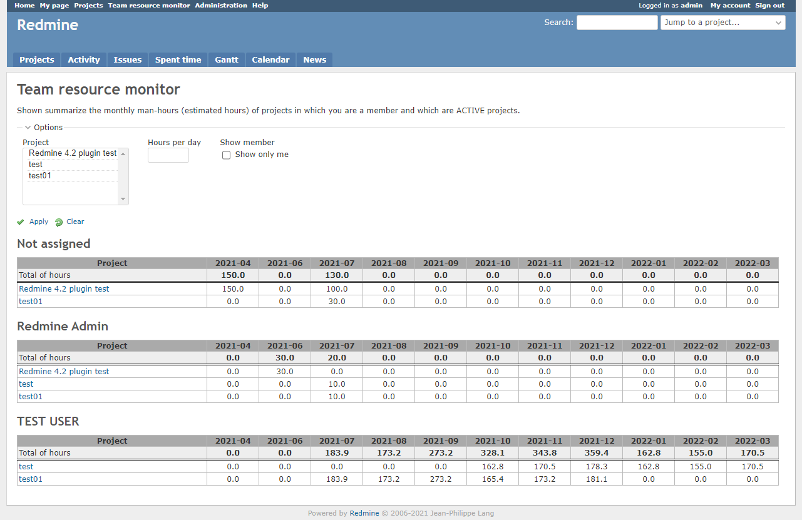

# Team resource monitoring Plugin

Aggregate the estimated time for the project you are assigned to. You can also aggregate the estimated time for any project.

## Current Version
0.4.1

## Compatibility
Redmine 4.0.0 and above

# Main features
Calculates estimated hours per month of assignee of the selected project.
The below are used.
* start date
* due date　(If empty, effective of version)
* estimated time

## About workig days
1. Excluding weekends
2. If the estimated hours are only for weekends, then the weekends are also calculated as working hours.

# Installation
(1) Getting plugin source

**case of zip file.**

* Download zip-file
* Create a folder named redmine_team_resource under [redmine_root]/plugins/
* Extract zip file in redmine_team_resource

**Case of git clone.**

```
git clone https://github.com/momibun926/redmine_team_resource [redmine_root]/plugins/redmine_team_resource
```

(2) Restart your Redmine web servers (e.g. mongrel, thin, mod_rails).


# UnInstall
```
rake redmine:plugins:migrate NAME=redmine_team_resource VERSION=0
```
# Screen shots
**Overview**


# Contributing
1. Fork it
2. Create your feature branch (git checkout -b my-new-feature)
3. Commit your changes (git commit -am 'Add some feature')
4. Push to the branch (git push origin my-new-feature)
5. Create new Pull Request

# My Environment
Environment:
 * Redmine version                4.2.2.stable.21129
 * Ruby version                   2.6.5-p114 (2019-10-01) [x86_64-linux]
 * Rails version                  5.2.6
 * Environment                    production
 * Database adapter               PostgreSQL
 * Mailer queue                   ActiveJob::QueueAdapters::AsyncAdapter
 * Mailer delivery                smtp